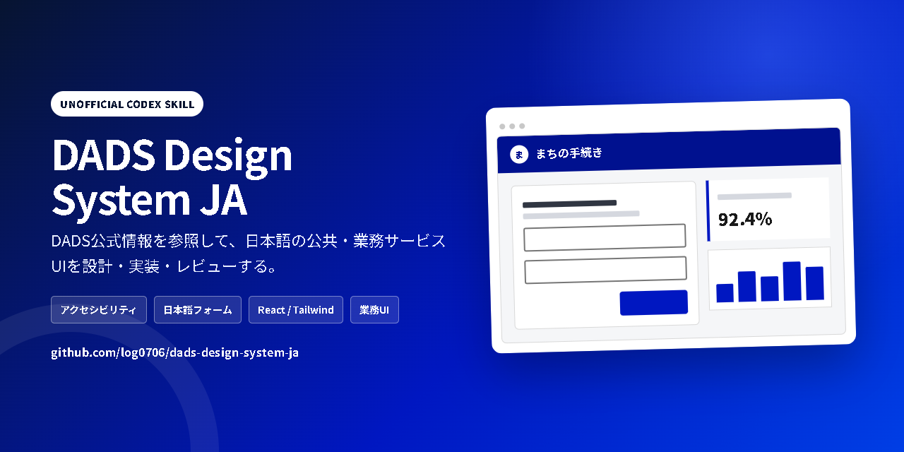
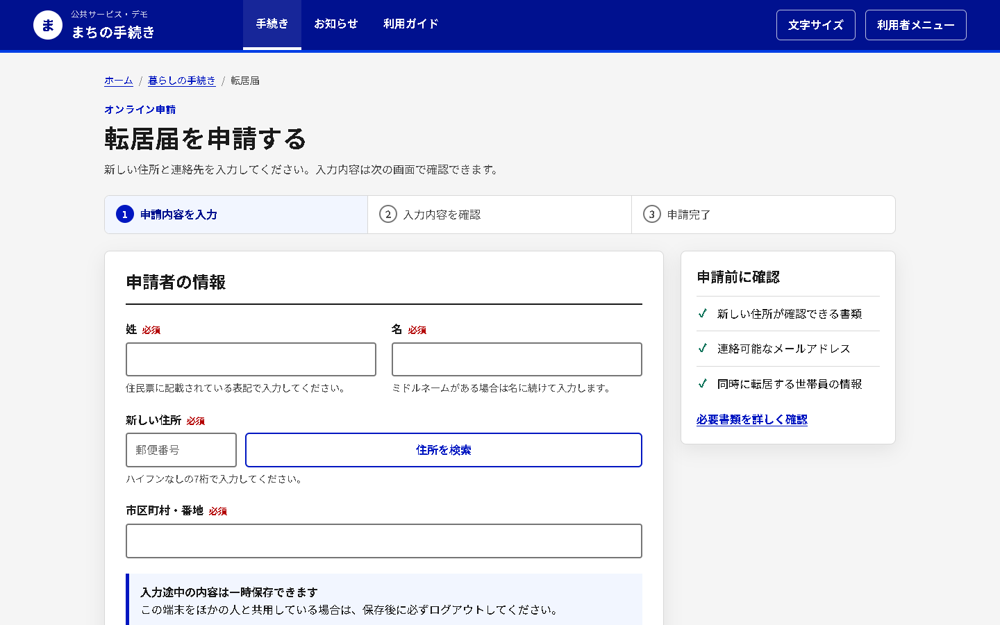
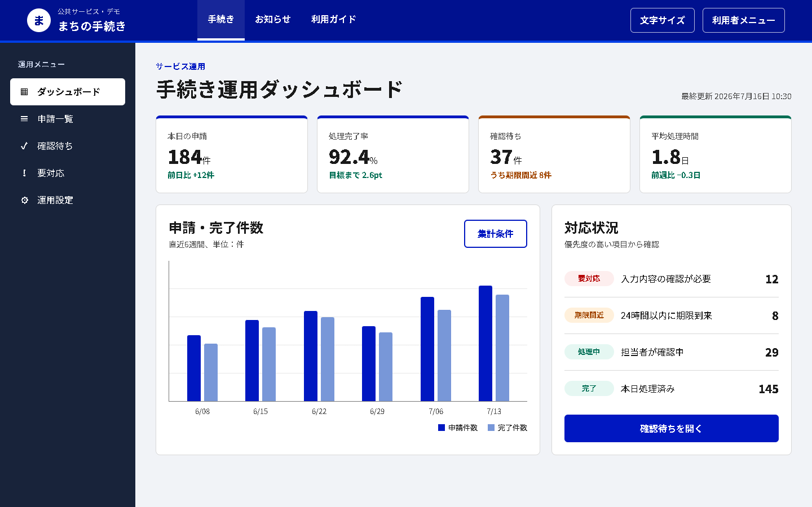
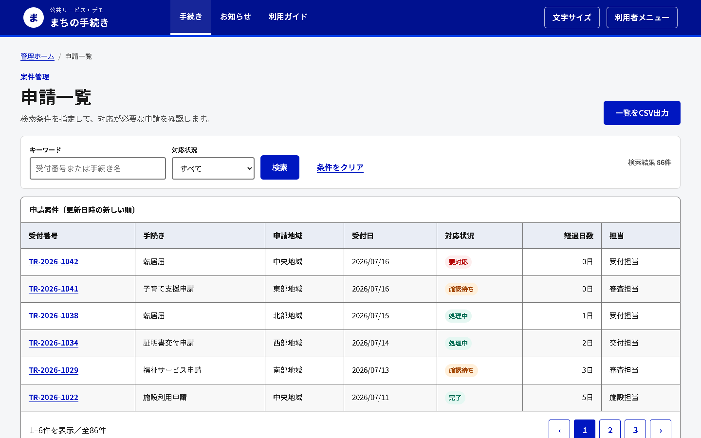

# DADS Design System JA for Codex

デジタル庁デザインシステム（DADS）の公式情報を参照し、日本語の公共・業務サービスUIを設計・実装・レビューするための、**非公式**Codex Skillです。



> [!IMPORTANT]
> このリポジトリはデジタル庁が提供・認定する公式Skillではありません。デジタル庁のロゴや公式ブランドは使用していません。

## できること

- 公共・行政サービス向けUIの設計
- 日本語フォーム、入力エラー、テーブル、検索・絞り込み、ナビゲーションの改善
- キーボード、フォーカス、コントラスト等のアクセシビリティレビュー
- HTML／React／Tailwindの公式サンプルを参照した段階導入
- DADSの情報階層や可読性を応用した硬い業務資料の設計
- 公式DADS由来の部分と独自変更部分を分けたレビュー報告

音楽、アート、MV、ジャケット、物語等、感情表現や世界観を最優先する制作物には使用しません。

## サンプル

以下は、同梱するオフラインHTML/CSSをブラウザで描画した架空画面です。実在のサービス・組織・個人・顧客データは使用していません。

### 日本語申請フォーム



### 公共サービス管理ダッシュボード



### 検索・絞り込み付き案件テーブル



サンプルの実装は [examples/showcase.html](examples/showcase.html) にあります。外部API、CDN、Webフォント、分析タグを使用せず、オフラインで動作します。

## インストール

Python 3.10以降を用意してください。

### macOS / Linux

```bash
git clone https://github.com/log0706/dads-design-system-ja \
  "${HOME}/.agents/skills/dads-design-system-ja"
cd "${HOME}/.agents/skills/dads-design-system-ja"
python scripts/update_official_sources.py
python scripts/validate_skill.py
```

### Windows PowerShell

```powershell
git clone https://github.com/log0706/dads-design-system-ja `
  "$HOME\.agents\skills\dads-design-system-ja"
Set-Location "$HOME\.agents\skills\dads-design-system-ja"
python scripts/update_official_sources.py
python scripts/validate_skill.py
```

公式Markdownはリポジトリに同梱していません。更新スクリプトがDADS公式リソースページから最新版を検出し、安全性を検証して `references/official/` へ展開します。

Skillが一覧に反映されない場合は、新しいCodexセッションまたはCodexの再起動後に確認してください。

## 使い方

明示的に呼び出す場合:

```text
$dads-design-system-ja を使って、この日本語申請フォームをレビューしてください。
```

暗黙的な利用例:

```text
この公共サービスの管理画面をDADSのアクセシビリティ基準でレビューしてください。
```

```text
DADSのReactコンポーネントを既存プロジェクトへ段階導入してください。
```

```text
DADSを参考に、金融機関向けの硬い業務資料を設計してください。
```

## 情報の分離

```text
dads-design-system-ja/
├── SKILL.md
├── agents/openai.yaml
├── references/
│   ├── official/                 # 更新スクリプトが取得。Git管理対象外
│   ├── official-index.md         # 公式原文への索引
│   ├── source-manifest.md        # 取得元・版・SHA-256
│   └── *.md                      # 独自の判断・実装・応用ガイド
├── scripts/
│   ├── update_official_sources.py
│   └── validate_skill.py
├── examples/showcase.html
└── assets/screenshots/
```

- `references/official/`: デジタル庁配布の公式Markdown。独自追記を禁止
- `references/*.md`: Codex向けの独自要約、判断、応用ルール
- `NOTICE.md`: 出典、非公式性、第三者コンテンツの扱い

## 安全な更新

```bash
python scripts/update_official_sources.py --check-only
python scripts/update_official_sources.py
python scripts/validate_skill.py
```

更新スクリプトは次を行います。

- 公式HTTPSホストだけを許可
- 最新の `dads-markdown-YYYYMMDD.zip` を検出
- SHA-256とZIP CRCを確認
- 絶対パス、パストラバーサル、シンボリックリンクを拒否
- ファイル数・展開サイズ・UTF-8・必須ファイルを検証
- 検証済みステージから原子的に置換
- 失敗時は既存公式データを保持または復元

通常のSkill利用時には自動更新しません。公式情報の更新を明示的に行うときだけ実行してください。

## ライセンスと出典

このリポジトリ独自のコードと文書は [MIT License](LICENSE) で公開します。

DADS公式コンテンツ、Figma、コードスニペット、イラスト・アイコンには、それぞれの公式利用条件が適用されます。詳細は [NOTICE.md](NOTICE.md) と [references/licensing.md](references/licensing.md) を確認してください。

## Star

このSkillが、日本語の公共・業務サービスUIを設計する方の役に立ちそうでしたら、GitHubでStarを付けていただけるとうれしいです。
